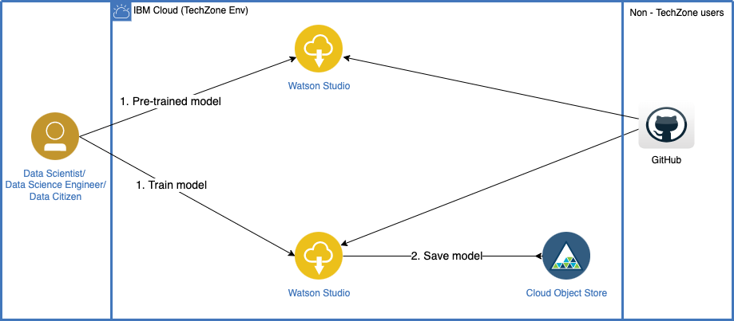
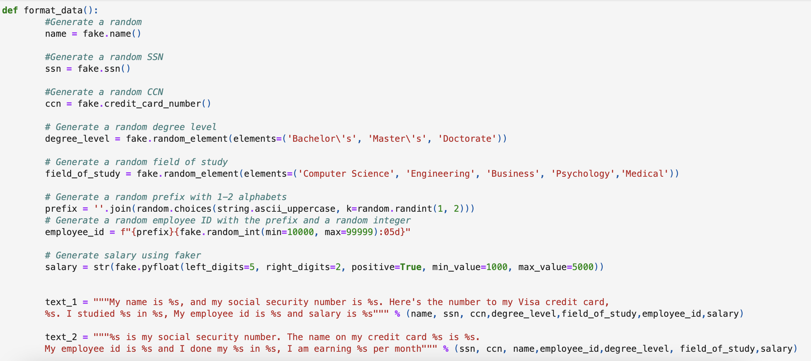

# Personal Identifiable Information (PII) extraction using Watson NLP

Personal Identifiable Information (PII) extraction refers to the process of identifying and extracting personal information from various sources, such as documents, databases, and websites. PII is any information that can be used to identify an individual, including their name, address, phone number, email address, social security number, driver's license number, credit card number, and more.

PII extraction is a crucial process in maintaining data privacy compliance while also extracting valuable insights from data. IBM Watson NLP models offer a powerful solution for PII extraction, utilizing natural language processing and machine learning techniques to accurately identify and extract personally identifiable information. Additionally, these models offer a flexible and scalable solution, allowing businesses to fine-tune the models to extract specific types of PII and integrate them into their applications for compliance with data privacy regulations. These models can help businesses improve operational efficiency by automating manual processes, reducing errors, and saving time and resources. 

The `watson_nlp` library is available on IBM Watson Studio as a runtime library so that you can directly use it for model training, evaluation, and prediction. The following figure shows the Watson NLP architecture.

This tutorial provides an introduction to IBM Watson NLP, covering the fundamental concepts and guiding you through the process of using <b>pre-trained models</b> and <b>fine-tuning</b> them for PII extraction.

# Prerequisites

To follow the steps in this tutorial, you need:

* An [IBMid](https://cloud.ibm.com/login?cm_sp=ibmdev-_-developer-tutorials-_-cloudreg)
* A Watson Studio project
* A Python [Fine-Tuned Models notebook](https://github.com/ibm-build-lab/Watson-NLP/blob/main/ML/PII-Extraction/PII%20Extraction%20-%20Fine-Tuned%20Models.ipynb)
* Your [environment set up](https://developer.ibm.com/tutorials/set-up-your-ibm-watson-libraries-environment/)

# Estimated time

It should take you approximately 1 hour to complete this tutorial.

# Steps

The tutorial consists of two part. First, it demonstrates the extraction of PII using pre-trained Watson NLP models. Second, we generate training data for custom PII entities and fine-tune the models. In this section, we focus on PII extraction models for the following PII entities: 

|Pre-trained models |Fine-tuned models|
|-------------------|-----------------|
|Name|Employee ID|
|Social Security Number|Salary|
|Credit Card number|Educational Detail|
|Email|Driving Licence Number|
|URL|Gender|

# Pre-Trained Watson NLP Models

## Step 1. Generate the data for custom PII 

1. Generate the sample data set for train the custom PIIs using faker library. Below table shows the custom PIIs which demonstrate in this tutorial:

|Custom PIIs|
|-----------|
|Name|
|Social Security Number|
|Credit Card Number|
|Employee ID|
|Education Details|
|Salary|
|Driving Licence Number|

Here is a demonstration of how to generate custom Personally Identifiable Information (PII) using Faker, which is a function for generating data. The generated custom PIIs can be utilized to create a sentence that includes all the relevant information. This sentence can then be used to fine-tune the model. The image below shows the data generation process for custom PIIs.

