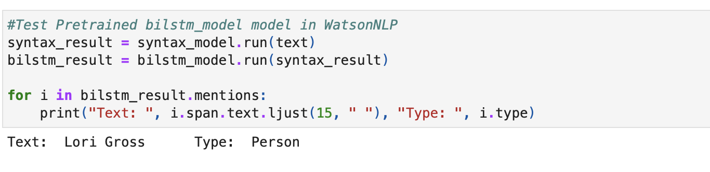
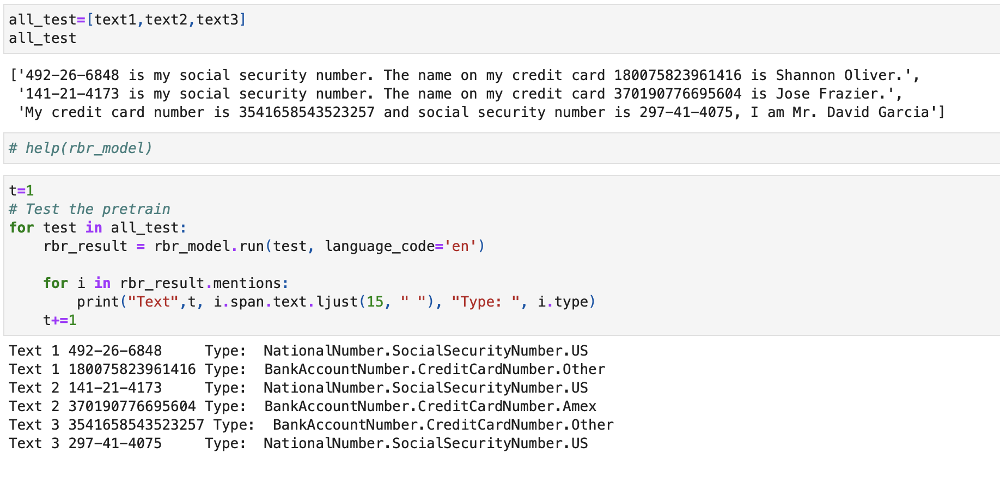

# Personal Identifiable Information (PII) extraction using Watson NLP

Personal Identifiable Information (PII) extraction refers to the process of identifying and extracting personal information from various sources, such as documents, databases, and websites. PII is any information that can be used to identify an individual, including their name, address, phone number, email address, social security number, driver's license number, credit card number, and more.

PII extraction is a crucial process in maintaining data privacy compliance while also extracting valuable insights from data. IBM Watson NLP models offer a powerful solution for PII extraction, utilizing natural language processing and machine learning techniques to accurately identify and extract personally identifiable information. Additionally, these models offer a flexible and scalable solution, allowing businesses to fine-tune the models to extract specific types of PII and integrate them into their applications for compliance with data privacy regulations. These models can help businesses improve operational efficiency by automating manual processes, reducing errors, and saving time and resources. 

The `watson_nlp` library is available on IBM Watson Studio as a runtime library so that you can directly use it for model training, evaluation, and prediction. The following figure shows the Watson NLP architecture.


This tutorial provides an introduction to IBM Watson NLP, covering the fundamental concepts and guiding you through the process of using <b>pre-trained models</b> and <b>fine-tuning</b> them for PII extraction.

# Prerequisites

To follow the steps in this tutorial, you need:

* An [IBMid](https://cloud.ibm.com/login?cm_sp=ibmdev-_-developer-tutorials-_-cloudreg)
* A Watson Studio project
* A Python [Pre-Trained Models notebook](https://github.com/ibm-build-lab/Watson-NLP/blob/main/ML/PII-Extraction/PII%20Extraction%20-%20Pre-Trained%20Models.ipynb)
* Your [environment set up](https://developer.ibm.com/tutorials/set-up-your-ibm-watson-libraries-environment/)

# Estimated time

It should take you approximately 1 hour to complete this tutorial.

# Steps

The tutorial consists of two part. First, it demonstrates the extraction of PII using pre-trained Watson NLP models. Second, we generate training data for custom PII entities and fine-tune the models. In this section, we focus on PII extraction models for the following PII entities: 

|Pre-trained models |Fine-tuned models|
|-------------------|-----------------|
|Name|Employee ID|
|Social Security Number|Salary|
|Credit Card number|Educational Detail|
|Email|Driving Licence Number|
|URL|Gender|


# Pre-Trained Watson NLP Models


## Step 1. Generate the testing data


1. Generate the sample data set for Name, credit card number and social security number using faker library.


## Step 2. PII Extraction 

The process of PII extraction involves identifying and extracting specific pieces of information, such as names, social security numbers, credit card details, and locations, from an input text. This is achieved through the use of an entity-mentions block, which encapsulates various algorithms designed to perform this task.

The entity-mentions block provides implementations of strong PII extraction algorithms from four different families: rule-based, classic machine learning, deep-learning, and transformers. These algorithms use different techniques and approaches to identify and extract PII from text, allowing for a more robust and comprehensive PII extraction process.

By leveraging the entity-mentions block and its various algorithms, organizations can ensure that they are effectively and accurately extracting PII from their data, thereby improving data privacy and security.

The process of identifying and PII entities from text can be accomplished using two different types of models:

1. A rule-based model, also known as the rbr model, which is designed to handle syntactically regular entity types such as numbers, emails, and phone numbers. This model relies on predefined rules to identify and extract these entities from text.

2. A model that is trained on labeled data for the more complex entity types such as persons, organizations, and locations. This model uses machine learning techniques to learn patterns and relationships between words and their corresponding entity types in order to accurately identify and extract entities from text.


## Step 2.1 PII extraction function

Rule-based models (RBR) can be directly applied to input text without any dependency on pre-processing blocks. On the other hand, models that are trained from labeled data, such as BilSTM and SIRE, require the syntax block to be executed first to generate the expected input for the entity-mention block.

Therefore, to perform PII extraction using these models, it is necessary to load the syntax model and three PII extraction models.


```
# Load a syntax model to split the text into sentences and tokens
syntax_model = watson_nlp.load(watson_nlp.download('syntax_izumo_en_stock'))
# Load bilstm model in WatsonNLP
bilstm_model = watson_nlp.load(watson_nlp.download('entity-mentions_bilstm_en_pii'))
# Load rbr model in WatsonNLP
rbr_model = watson_nlp.load(watson_nlp.download('entity-mentions_rbr_multi_pii'))
# sir Load rbr model in WatsonNLP
sire = watson_nlp.load(watson_nlp.download('entity-mentions_sire_en_stock-wf'))
```

## Step 2.2 Run the models for PII Extraction 

* BiLSTM Pretrained

The term "pretrained" refers to a pre-trained BiLSTM model, which has already been trained on a large corpus of text data and can be fine-tuned or used as is for specific NLP tasks, such as PIIs or entities extraction, and so on. By using a pretrained BiLSTM model, you can leverage the knowledge learned from the training data to quickly build NLP applications with improved accuracy.




As shown in above result. Pre-Trained BiLSTM Model can detect the person name as `Lori Gross`. 


* RBR Pretrained

A pretrained rule-based model is a model that has already been trained on a large corpus of text data and has a set of predefined rules for processing text data. By using a pretrained rule-based model, you can leverage the knowledge learned from the training data to quickly build NLP applications with improved accuracy.




As shown in above result. Pre-Trained RBR Model can detect the credit card numbers and social security numbers.


## Conclusion

This tutorial showed how to use the Watson NLP library and how easily you can run various PII Extraction using Pre-trained models on input text. This notebook also demonstrated one possible application of Watson NLP.

Work through the [notebook](https://github.com/ibm-build-lab/Watson-NLP/blob/main/ML/PII-Extraction/PII%20Extraction%20-%20Pre-Trained%20Models.ipynb) to try out this feature.
