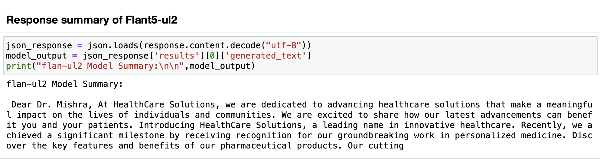

# Summarize the document using Watsonx.ai API

Watsonx.ai is an integral component of the IBM WatsonX platform, which seamlessly integrates cutting-edge generative AI capabilities, harnessed from foundational models and traditional machine learning, into a dynamic studio encompassing the entire AI development lifecycle. With Watsonx.ai, you can train, validate, fine-tune, and deploy generative AI, foundational models, and machine learning capabilities. This streamlined approach allows you to construct AI applications in significantly less time and with reduced data requirements.

Summarization is a valuable approach that enables us to cut through the noise and extract the essence of complex information. Whether dealing with lengthy emails, extensive documents, or dynamic chat interactions, the ability to generate concise summaries is a game-changer. This blog explores how Watsonx.ai takes summarization to the next level. Here we leverage the Watsonx.ai API within a Jupyter Notebook to demonstrate two use-case as chat summarization and mail summarization.

# Prerequisites

## To follow the steps in this tutorial, you need:

### Signing up for IBM Watsonx as a Service

Embarking on the journey of leveraging IBM Watsonx.ai is an exciting prospect, offering a gateway to powerful tools for working with foundation models. Before diving into the Prompt Lab of Watsonx.ai, it's essential to understand the mandatory prerequisites for signing up. Follow these steps for a seamless onboarding experience with IBM Watsonx.ai or refer to the [signup guide](https://dataplatform.cloud.ibm.com/docs/content/wsj/getting-started/signup-wx.html?context=wx&audience=wdp#personal).

1. Go to [Try IBM watsonx.ai](https://eu-de.dataplatform.cloud.ibm.com/registration/stepone?context=wx&apps=data_science_experience,watson_data_platform,cos&uucid=0b526de8c1c419db&utm_content=WXAWW?context=wx&audience=wdp&preselect_region=true)
2. Select the IBM Cloud service region. You can select the Dallas or Frankfurt region.
3. Enter your IBM Cloud account username and password. If you don't have an IBM Cloud account, create one.
4. If you see the <b>Select account</b> screen, select the account and resource group where you want to use watsonx. If you belong to an account with existing services, you can select it instead of your account. The <b>Select account</b> screen does not display if you have only one account and resource group.
5. Click <b>Continue</b>. The account activation process begins.


# Estimated time

It should take you approximately 60 minutes to complete this tutorial.


# Steps

## Generate the Summary Using Watsonx.ai API (Notebook)

## 1. Mail Summarization (Document Summarization)


Before we get started, make sure to create your personal API key (YOUR_ACCESS_TOKEN) on IBM Cloud. Check out the [documentation](https://cloud.ibm.com/docs/account?topic=account-userapikey&interface=ui) for a user-friendly guide on this important step. To execute these exercises, it's essential to set up and run a [Jupyter Notebook](https://github.com/sahil11129/Projects/blob/main/WatsonX/Summarisation%20%20Using%20WatsonX.ai.ipynb).


1.1 Read the document

Here, we can upload the document slated for summarization. Specifically, we have a file named [HealthCare Email.txt](https://github.com/sahil11129/Projects/blob/main/WatsonX/HealthCare%20Email.txt) containing the email content that we'll be summarizing. 


```
with open("HealthCare Email.txt", 'r') as file:
    doc = file.read()
```

1.2 Set header with YOUR_ACCESS_TOKEN

```
headers = {
    'Content-Type': 'application/json',
    'Authorization': 'Bearer YOUR_ACCESS_TOKEN',
}
```

1.3 Set Model ID and Model Parameters 

In the upcoming step, we'll focus on configuring the model by setting its unique Model ID. This involves defining specific model details and instrumentation, providing essential guidance to the model for task specification. Additionally, we'll leverage the document object loaded earlier as the input, coupled with adjusting parameters such as `max_new_tokens`, `min_new_tokens`, and `decoding_method`. This strategic customization ensures that the model is finely tuned to generate responses aligned with the desired outcomes.

```
json_data = {

    'model_id': 'google/flan-ul2',


    'inputs': ['Summarize the email text. \\n\\ntext: '+doc],

        "parameters": {
        "decoding_method": "greedy",
        "max_new_tokens": 100,
        "min_new_tokens": 50,
        "repetition_penalty": 1.5
      },
}
```
1.4 Send API request to the Watsonx.ai server 

This step involves sending a POST request to the Watsonx.ai server's text generation endpoint using the provided URL. The headers variable contains any necessary information for the request, and json_data holds the payload with details required for text generation. The response variable stores the server's response, allowing access to the generated text or additional information provided by the Watsonx.ai server.

```
response = requests.post('https://us-south.ml.cloud.ibm.com/ml/v1-beta/generation/text?version=2023-05-29', headers=headers, json=json_data)
```

1.5 Response from the Watsonx.ai server

The response from the server, including the generated text or any relevant information, is stored in the response variable for further handling and analysis.





## 2. Chat Summarization using Watsonx.ai

In the Prompt Lab in IBM watsonx.ai, you can experiment with prompting different foundation models, explore sample prompts, and save and share your best prompts. You use the Prompt Lab to engineer effective prompts that you submit to deployed foundation models for inferencing. You do not use the Prompt Lab to create new foundation models. 

### Requirements
If you signed up for watsonx.ai and you have a sandbox project, all requirements are met and you're ready to use the Prompt Lab.

You must meet these requirements to use the Prompt Lab:

- You must have a project.
- You must have the Editor or Admin role in the project.
- The project must have an associated Watson Machine Learning service instance. Otherwise, you are prompted to associate the service when you open the Prompt Lab.

Now navigate to the watsonx.ai home page, select a project, and click on <b>Experiment with foundation models and build prompts</b> to access the dedicated Prompt Lab. Here, you can explore and optimize prompts for various foundation models, facilitating a seamless experimentation process within your chosen project.

This practical demonstration uses the `flan-ul2-20b` model, specifically tuned with default parameters, to generate a concise summary of a sample conversation between an agent and a customer.

## 2.1 Set instructions in the Prompt Lab:
<b>Instruction:</b> The following text is a conversation between an agent and a customer. Read the text and then write a summary.


## 2.2 Input Data: Conversation Between Customer and Agent

```
Customer: Hi, I'm having trouble with my recent order. The delivery seems to be delayed, and I was wondering if you could provide some assistance.

Agent: Hello! I'm sorry to hear about the delay in your order. Could you please provide me with your order number so that I can look into the details for you?

Customer: Sure, my order number is 123456789.

Agent: Thank you for providing that. Let me check the status of your order. It seems there was a slight delay in processing, and I apologize for any inconvenience caused. Rest assured, I'll expedite the shipment, and you should receive it within the next two business days.

Customer: Thank you for your quick response. I appreciate your help in resolving this issue.

Agent: You're welcome! If you have any further questions or concerns, feel free to reach out. We're here to help. Have a great day!
```

## Model Used: 
flan-ul2-20b with Default Parameters


## Output Summary:
`Agent expedites the shipment of the customer's order. The customer will receive it within the next two business days.`

The conversation summary holds potential, and now we can explore the diverse LLM models offered in watsonx.ai, adjusting parameters to assess their capabilities and performance. After the experimentation phase, saving our work as either a notebook or a prompt template is straightforward. Just click on  <b>Save work</b> at the top right corner to generate the corresponding code effortlessly.


In this blog, we'll take you through the incredible summarization powers of Watsonx.ai using two  methods: the Prompt Lab and the API. Think of the Prompt Lab as your play space to explore and get to know Watsonx.ai's summarization abilities. Now, if you're eager to bring summarization into your real-world applications, the API method is your go-to, offering a seamless way to integrate this solution for instant use. These approaches highlight how Watsonx.ai caters to both exploration and real-world implementation, making summarization a breeze. For a deeper understanding of Watsonx.ai and its features, please refer to the official [documentation](https://dataplatform.cloud.ibm.com/docs/content/wsj/getting-started/overview-wx.html?context=wx&audience=wdp) provided. 


